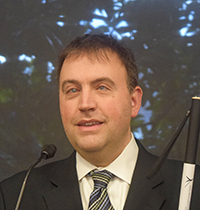

# Pre-conference

<strong>NOTE:</strong> Unfortunately, the originally scheduled keynote speaker, Karen Nakamura, is unable to 
participate in the NDLC pre-conference event. We are pleased to announce that Mark Riccobono, president of the National Federation for the 
Blind, will be giving our closing keynote address.

## Keynote Speaker
 {.float_left} Born in Milwaukee, Wisconsin, Mark Riccobono was diagnosed with glaucoma and aniridia at age five. Nonetheless, Mark attended public schools, graduating with honors while active in debate and track.

    Mark earned a bachelor's degree in business administration at the University of Wisconsin-Madison. During his senior year, Mark was elected president of
    the National Federation of the Blind (NFB) of Wisconsin.

    After graduation, Mark joined the Sears executive trainee program, and spent his free time advocating for the blind. He was appointed to the Wisconsin
    State Superintendent's Blind and Visual Impairment Education Council, and became the first director of the Wisconsin Center for the Blind and Visually
    Impaired, an agency responsible for statewide services to blind children. Afterward he took a position in Baltimore with the NFB and earned a Master of
    Science in Educational Studies from the Johns Hopkins School of Professional Studies in Business and Education.

    Mark served as the executive director of the NFB Jernigan Institute and in January 2011 at the Daytona International Speedway, Mark navigated a car
    equipped with nonvisual technology for 1.5 miles, demonstrating the first time a blind individual has driven a street vehicle in public without the
    assistance of a sighted person.

    On July 5, 2014, the National Federation of the Blind elected Mark to serve as its president at its national convention in Orlando, Florida. Mark and his
    wife, Melissa, have three children, Austin, Oriana, and Elizabeth.

    <em>Driving Change: Individual Action, and Institutional Excellence</em>

    This presentation will explore how to go beyond the limits of old models to consider new means of providing access to information in library, archive, and
    museum fields. Innovation and inclusion begins with individual actions that shape institutional practices. As President of the National Federation of the
    Blind, Mark A. Riccobono has a unique perspective on access to information, institutional change, and the value of diversity in designing new means of
    providing access to the world's knowledge. Be prepared to become the change you want to see in the world and interact with the world's first blind driver.

## Concurrent Workshops

The schedule for the pre-conference forum will include several concurrent workshops on the following topics:

<ul>
<li><strong>Customer Service</strong>: etiquette and effective communication</li>
<li><strong>Instruction &amp; Teaching</strong>: universal design of instruction</li>
<li><strong>Web Design</strong>: principles of accessibility, overview of tools</li>
<li><strong>Procurement</strong>: procedures for buying accessible materials; policy; Voluntary Product Accessibility Template (VPAT); documentation</li>
<li><strong>Exhibit Design</strong>: collections without barriers</li>
<li><strong>The Intersection of Race and Disability</strong></li>
</ul>

The forum content will be relevant to a broad range of professionals from all types of libraries (academic, public, special, archives) as well as museum professionals. The full agenda will be available soon.
